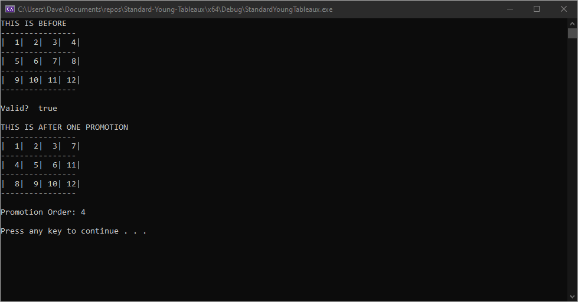

# Standard-Young-Tableaux
From the field of [Enumerative Combinatorics](https://en.wikipedia.org/wiki/Enumerative_combinatorics)  
Performs promotion and determines the order of standard [young tableaux](https://en.wikipedia.org/wiki/Young_tableau)

